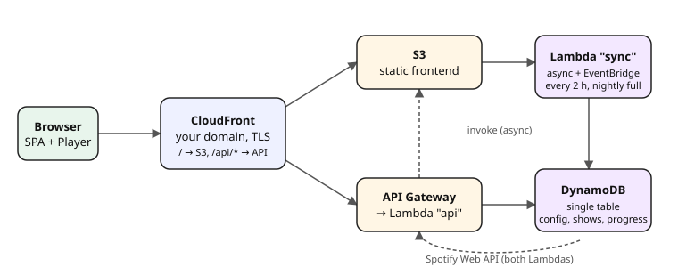

# Podcast-Cockpit

A personal web app that sits in front of Spotify and answers one question when
you open it: **what's new in my news podcasts, and which episode of my
long-running series is next?**

Each podcast gets a *consumption mode*:

| Mode | German UI | Behaviour |
| --- | --- | --- |
| `LATEST` | Aktualität | Suggests the newest episode, but only if you haven't finished or skipped it yet. |
| `SEQUENTIAL` | Reihenfolge | Works through the show oldest-first and continues after the last episode you finished. |
| `MANUAL` | Frei | Suggests only the episode you chose yourself. |

The **Woche** (week) page is a recurring weekly plan: for example, the news
on weekday mornings and your history series on Tuesday and Thursday
evenings. For every slot the app picks the concrete episode, so a series
planned twice a week shows episode n on Tuesday and n+1 on Thursday. The
**Heute** (Today) page puts today's slots on top, ticks off what you've
finished, and fills the rest of your daily time budget by priority. You can play an episode in the browser
(Spotify Web Playback SDK, Premium), on any Spotify Connect device (phone,
speaker…), or open it in the Spotify app.

The UI is in German and English (following the browser, switchable in
*Einstellungen*). The code and docs are in English.



## Features

- **Spotify login (OAuth).** The first Spotify account that logs in becomes the owner, and every other account is rejected. The Spotify password never touches the app.
- **Configuration as part of the deployment.** The Spotify client ID comes from `.env` or CI variables; the client secret lives in SSM Parameter Store and never appears in code or templates. There is no setup page.
- **Import of your saved shows**, with a guessed mode and categories (daily shows → `LATEST`, plus keyword-based categories). A review screen lets you confirm the guesses quickly.
- **Idempotent sync**: new episodes every 2 hours, a full refresh every night, and manual sync at any time. A sync only writes metadata. Your personal progress is stored in separate records and is never overwritten.
- **Spotify's listening state is used as a hint.** Episodes that are partly played in Spotify show up as *Weiter* (continue), with the remaining time. Episodes that Spotify reports as fully played count as heard. You can turn that off in the settings, and your own marks always win.
- **Weekly plan** of recurring rules: a podcast on some weekdays at a part of day (morning, midday, evening, anytime), e.g. "weekdays in the morning". A podcast can have several rules, editable on *Woche* or on the podcast's page. Their slots are projected onto concrete episodes for the next 7 days, and episodes you finish today are ticked off in the plan.
- **Next and last heard per podcast**, shown in the overview for every podcast.
- **Notes per episode**, saved automatically. While an episode plays in the browser, a notes button in the player inserts the current position as `[12:34]`. Tapping a timestamp later jumps back to that point. All notes are searchable under Verlauf → Notizen and included in the export.
- **Actions on each episode:** heard, unheard, skip, set as next episode, "mark all earlier episodes as heard", reset to the Spotify state, open in Spotify.
- **Podcast settings:** mode, multiple categories (free-form), pause, hide from Today, re-offer skipped episodes, and priority order.
- **Daily budget** with tolerance. Episodes are picked in your priority order, counting only the remaining time of episodes you have already started.
- **Other pages:** a history page, a JSON export, and "delete all data".
- **Mobile-first UI** with light/dark mode. It can be installed as a home-screen app.
- **Offline demo** with generated podcasts (`pnpm dev:demo`).

## Repository layout

```
packages/
  shared/      domain types + pure logic (next-episode selection, budget, weekly plan)
  backend/
    src/       Hono API, Lambda handlers, Spotify service layer, DynamoDB/in-memory stores
    dev/       local development server
    test/      tests and fakes (fake Spotify)
  frontend/
    src/       React SPA (Vite, TanStack Query, React Router)
    dev/       development-only helpers (fake Web Playback SDK)
    test/      tests
  infra/       AWS CDK app
docs/          requirements, architecture decisions, Spotify API notes
```

Why it is built this way: [docs/decisions.md](docs/decisions.md). What it
does: [docs/requirements.md](docs/requirements.md). How code, commits and pull
requests are written: [CONTRIBUTING.md](CONTRIBUTING.md).

## The Spotify app

The app talks to Spotify through **your own Spotify developer app**. That is
nothing more than an entry in Spotify's developer dashboard that gives you a
Client ID and Client Secret. You create it once and use it both locally and on
AWS:

1. Open the [Spotify Developer Dashboard](https://developer.spotify.com/dashboard) and create an app (name and description are up to you).
2. Under **APIs used**, select *Web API* and *Web Playback SDK*.
3. Under **Redirect URIs**, add every address the app runs at. One app can have several:
   - `http://127.0.0.1:5173/api/auth/callback` for local development. Spotify only allows plain `http` for loopback IPs, not for `localhost`.
   - `https://<your domain>/api/auth/callback` for AWS (shown as the `SpotifyRedirectUri` output after deploying).
4. Copy the Client ID and Client Secret from the app's settings into your `.env` (see [Configuration](#1-configuration)).

In Spotify's development mode, the app works for its owner (you; Spotify
Premium required) and up to five users you add under *User Management*.

## Run locally

Requires Node.js 22+ and pnpm (`corepack enable` picks the version from
`package.json`).

```bash
pnpm install
```

**Demo without Spotify.** Fake podcasts, fake login and a fake browser player;
no Spotify app needed:

```bash
pnpm dev:demo        # API on :8787, UI on http://127.0.0.1:5173
```

Open http://127.0.0.1:5173 and click *Mit Spotify anmelden*. All demo wiring
lives in `packages/backend/dev/` and `packages/frontend/dev/`; the app itself
has no demo mode.

**Against real Spotify.**

```bash
cp .env.example .env   # fill in SPOTIFY_CLIENT_ID and SPOTIFY_CLIENT_SECRET
pnpm dev
```

1. Open **http://127.0.0.1:5173**. Use exactly this address, not `localhost`, so it matches the redirect URI.
2. Log in with Spotify. The first account that logs in becomes the owner; the first import starts automatically.

Local data is stored in `packages/backend/.local-data/` (separate from AWS).

```bash
pnpm test            # all tests (DynamoDB via dynalite, CDK assertions)
pnpm typecheck
```

## Deploy to AWS

### 1. Configuration

Every setting can come from an environment variable – your `.env` (copy
[`.env.example`](.env.example)) or, in CI, the pipeline's variables – or from
CDK context (`packages/infra/cdk.json` or `-c key=value`). The environment
wins. There is no dotenv library: the package scripts and the `cdk` app
command pass `--env-file-if-exists=../../.env` to Node, so every entry point
loads the same file, and real environment variables take precedence over it.

| Environment variable | CDK context | Example | Notes |
| --- | --- | --- | --- |
| `SPOTIFY_CLIENT_ID` | `spotifyClientId` | `3f1c…` | Client ID of [your Spotify app](#the-spotify-app). Not a secret. Required – synth fails without it. |
| `DOMAIN_NAME` | `domainName` | `podcasts.example.com` | Optional. Without it, the app runs on the CloudFront domain. |
| `HOSTED_ZONE_NAME` | `hostedZoneName` | `example.com` | Defaults to the parent domain of `domainName`. Must be a Route 53 hosted zone in the same account. |
| `CERTIFICATE_ARN` | `certificateArn` | `arn:aws:acm:us-east-1:…` | Only if your DNS is **not** in Route 53. The certificate must be in us-east-1. You then point a CNAME at the `DistributionDomain` output yourself. |
| `STAGE` | `stage` | `dev` | Deployment stage (default `dev`; lower-case letters, digits, `-`). Part of the stack names (`PodcastCockpit-dev`, `PodcastCockpit-dev-Certificate`) and of the secret's SSM path, so several stages can live in one account, each with its own `DOMAIN_NAME`. |
| `STACK_NAME` | `stackName` | `PodcastCockpit` | Optional name prefix of the stacks and the SSM path. |

Every resource of both stacks is tagged `app=podcast-cockpit`, `stage=<stage>` and `managed-by=cdk`. To see costs per app and stage, activate `app` and `stage` as cost allocation tags in AWS Billing.

> Earlier versions named the stacks `PodcastCockpit` and `PodcastCockpitCertificate` (without a stage). A deploy creates the new `-<stage>` stacks next to them rather than updating them, so delete the old stacks first. DynamoDB keeps a table with retained data (`PodcastCockpit-Table…`); delete it too if you don't need it.

The client secret is **not** part of this configuration; it is set after the
first deploy (step 4).

The main stack goes to `CDK_DEFAULT_REGION` (your AWS profile's region). If
none is set, it goes to `eu-central-1`. With a Route 53 domain, a small extra
stack creates the TLS certificate in `us-east-1`, which CloudFront requires.

**AWS account.** cdk and `secret:put` use the profile in `AWS_PROFILE`. Put
it in `.env` to pin this repository to one account: the package scripts start
the CDK CLI with `.env` loaded, before it resolves credentials. A shell
`AWS_PROFILE` still wins. With AWS SSO, log in first:
`aws sso login --profile <name>`. Always deploy through the package scripts,
not a bare `cdk`, which wouldn't see `.env`.

### 2. Bootstrap (once per account/region)

```bash
pnpm --filter @podcast/infra run bootstrap aws://<ACCOUNT>/eu-central-1 aws://<ACCOUNT>/us-east-1
```

### 3. Deploy

```bash
pnpm run deploy      # from the repo root: builds the frontend, then `cdk deploy --all`
```

The outputs show `Url`, `SpotifyRedirectUri` and `SpotifyClientSecretParameter`.

### 4. Set the client secret (once, after the first deploy)

The stack creates an SSM Parameter Store *SecureString* named
`/<STACK_NAME>/<STAGE>/spotify-client-secret`, e.g. `/PodcastCockpit/dev/spotify-client-secret` (the `SpotifyClientSecretParameter`
output) with a placeholder. Until you replace it, the app shows *Spotify-App
fehlt*. Set it with:

```bash
pnpm run secret:put                    # reads SPOTIFY_CLIENT_SECRET from .env or the environment
pnpm run secret:put -- -c stage=prod   # same -c context arguments as cdk
```

The script looks up the parameter name in the stack's outputs and must run
with the same AWS profile and region you deployed to. It resolves the stack
like `cdk` does (environment, `-c` arguments, `cdk.json`) and prints the
target stack first. You can also edit the
parameter in the AWS console, or in CI run
`aws ssm put-parameter --name /PodcastCockpit/dev/spotify-client-secret --type SecureString --overwrite --value "$SPOTIFY_CLIENT_SECRET"`.
Redeploys never touch the value. Repeat this step when you rotate the secret
in the Spotify dashboard; the app picks it up within five minutes.

**Why Parameter Store.**
- A plain Lambda environment variable would put the secret into the
  CloudFormation template and the Lambda console. A SecureString is encrypted
  with KMS and only read by the Lambdas at runtime.
- Standard parameters cost nothing; Secrets Manager costs $0.40 per secret
  per month, and its main extra (automatic rotation) doesn't apply to a
  Spotify secret.
- CloudFormation can't create SecureString parameters with a value. The stack
  therefore creates the parameter with a placeholder through a small custom
  resource, so the real value never appears in a template.

### 5. Log in

1. Add the `SpotifyRedirectUri` output to the redirect URIs of [your Spotify app](#the-spotify-app), e.g. `https://podcasts.example.com/api/auth/callback`.
2. Open the `Url` and log in with Spotify. The first account that logs in becomes the owner; every other account is rejected. Only accounts listed under *User Management* of your Spotify app can log in at all, so nobody else can claim the installation first.
3. The first import runs automatically. Then confirm the guessed mode and categories under **Podcasts → Prüfen**.

### Costs

For one user, this stays in or near the AWS free tier: Lambda, DynamoDB on-demand, API Gateway and CloudFront each cost a few cents at most; the SSM parameter is free. A Route 53 hosted zone costs $0.50 per month. Point-in-time recovery for DynamoDB is enabled, and on such a tiny table it costs fractions of a cent.

## How it works

- **Single origin.** CloudFront serves the SPA from S3 and forwards `/api/*` to API Gateway (HTTP API) and a Lambda function running a [Hono](https://hono.dev) app. Because everything is on one origin, there is no CORS.
- **Cookies.** The session cookie is `HttpOnly`, `Secure` and `SameSite=Strict`. The short-lived OAuth state cookie is `SameSite=Lax`, because Spotify's redirect back to the app is a cross-site navigation and browsers drop `Strict` cookies on those. Requests that change data must be sent as JSON, which works as an additional CSRF guard.
- **Tokens stay on the server.** Spotify access and refresh tokens are kept in DynamoDB. The browser only gets a short-lived access token for the Web Playback SDK, which needs one.
- **Sync** runs in a separate Lambda function: asynchronously from the API (because API Gateway times out after 29 s), every 2 hours, and once a day as a full refresh. A lease in DynamoDB (a conditional write on the sync state) ensures that two syncs never run at once.
- **Data model:** one DynamoDB table. Episodes (`EP#<show>`) and progress (`PROG#<show>`) are separate items, so a sync can never overwrite your progress. Each show item carries a summary (next episode, counts) that is recomputed after every change. That way, "Heute" and the overview only need to read the list of shows. Details are in [`packages/backend/src/store/dynamo.ts`](packages/backend/src/store/dynamo.ts).
- **Spotify layer:** [`packages/backend/src/spotify`](packages/backend/src/spotify). It refreshes tokens (including rotated refresh tokens), retries on 429 using `Retry-After` and on 5xx errors, and turns 401/403 into readable messages. The `SpotifyApi` interface can be replaced, for example by the offline fake or a future YouTube source. See [docs/spotify-api.md](docs/spotify-api.md) for the endpoints used and the 2026 restrictions for apps in development mode.

## Spotify's terms

The app uses the Spotify Platform under Spotify's
[Developer Terms](https://developer.spotify.com/terms),
[Developer Policy](https://developer.spotify.com/policy) and
[Design & Branding Guidelines](https://developer.spotify.com/documentation/design).
In short (details in [docs/decisions.md](docs/decisions.md), D16):

- **Non-commercial.** It plays episodes in the browser, which makes it a
  *streaming* app, and those may not be commercial: no ads, no paid access.
- **Attribution.** Spotify content is shown with the official Spotify logo
  (unmodified files in `packages/frontend/public/spotify/`) and links back
  to Spotify.
- **Retention.** Podcasts you unfollow in Spotify are deleted after 30 days.
  If you revoke the app's access in your Spotify account, it stops using
  Spotify immediately and deletes your data after 30 days, unless you log in
  again.

## Resetting

- **Wrong Spotify account, or locked out:** delete the item `PK=META, SK=CONFIG` from the DynamoDB table and log in again with the right account. This keeps your progress.
- **Delete everything:** go to Settings → *Alle Daten löschen*. The table itself has a `Retain` policy, so it survives `cdk destroy`.

## Not in this MVP (ideas for later)

- YouTube channels/playlists as a second source. The data model already has a `source` field, and the Spotify layer sits behind an interface.
- Tags per episode, statistics.
- One-off plan entries for specific dates (on top of the recurring weekly plan).
- Smarter daily planning (knapsack instead of greedy, weekday-specific budgets).
- Push notification when a priority show has a new episode.
